# blumi

<p align="center">
  
</p>

<p align="center">
  <em>A local-first, provider-agnostic agentic coding companion —<br>
  one Rust core, three faces: a terminal UI, a web UI, and a phone app.</em>
</p>

<p align="center">
  <a href="https://github.com/ankurCES/blumi-cli/stargazers"></a>
  <a href="https://github.com/ankurCES/blumi-cli/actions/workflows/ci.yml"></a>
  <a href="https://github.com/ankurCES/blumi-cli/wiki"></a>
  <a href="LICENSE"></a>
</p>

<p align="center">
  <strong>⭐ If blumi puts your idle compute to work, <a href="https://github.com/ankurCES/blumi-cli">give it a star</a> — it helps others find it.</strong>
</p>

`blumi` is a single Rust binary whose UI-agnostic core emits one typed event stream, so every
surface shows the same session: a [crush](https://github.com/charmbracelet/crush)-inspired
**terminal UI**, an embedded React **web UI**, an always-on **gateway**, and **blugo** — a
Flutter **phone app** that's a 1:1 mirror of the TUI, optimized for foldables.

|  Terminal UI (`blumi tui`) | Phone app (blugo) |
|---|---|
| 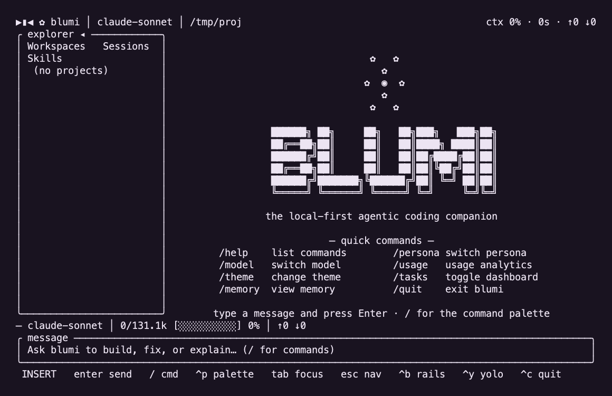 | 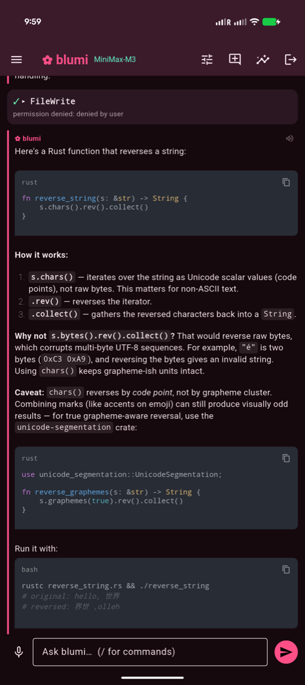 |

> 📖 **Full setup & help lives in the [Wiki](https://github.com/ankurCES/blumi-cli/wiki)** —
> installation, configuration, the always-on gateway, the mobile app, the distributed grid,
> voice, self-management, and troubleshooting, each with step-by-step guides for different setups.

### 🌐 One grid, every machine you own

blumi turns the idle compute on your LAN into a single **distributed AI grid**. Point several
`blumi serve` gateways at the same secret and they auto-discover each other; then **fan one task
across all of them** — from the terminal, the web UI, or right from your phone — and each machine
runs its share and reports back, tagged by hostname and OS. When compute is expensive, none of
yours sits idle. → jump to **[Grid (distributed)](#grid-distributed)**.

<p align="center">
  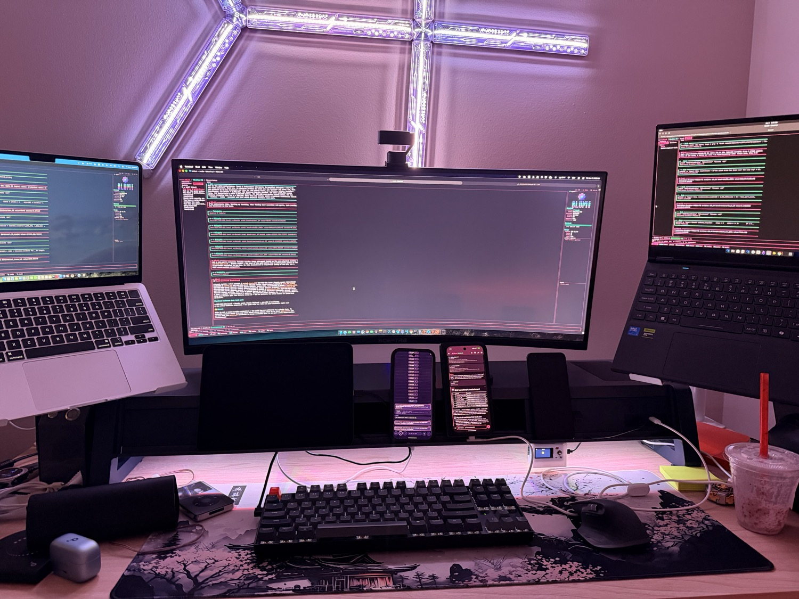<br>
  <em>One job, four faces: a MacBook Air (Apple Silicon), a MacBook Pro (the orchestrator), a Linux laptop (x86_64),
  and the <strong>blugo</strong> phone app — every node running blumi, sharing the work.</em>
</p>

<p align="center">
  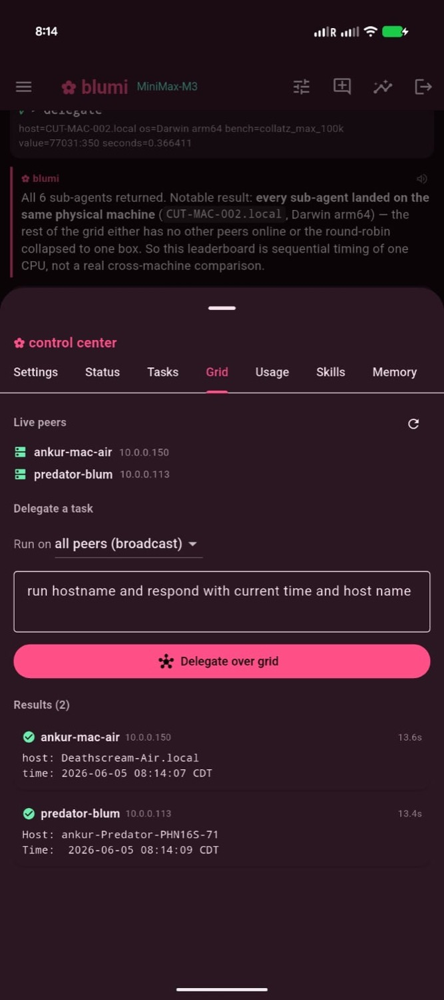
  &nbsp;&nbsp;
  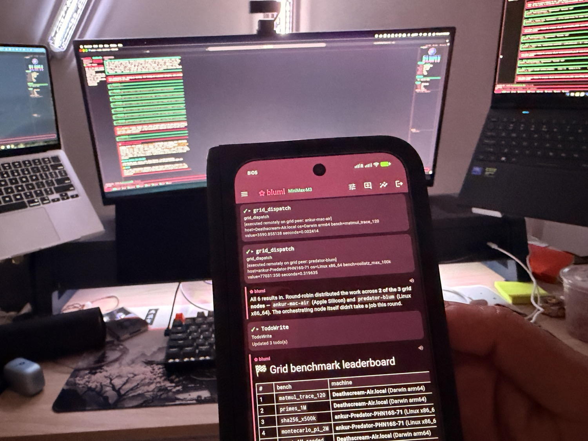
</p>
<p align="center">
  <em>Delegate a task across the grid from your phone (left) — pick a peer or broadcast to all —
  and watch every machine answer (right). No model tool-calling required.</em>
</p>

### 🧠 Private memory that compounds — and code it understands

blumi remembers across sessions with a **bundled local embedding model** (no API, nothing leaves
your machines): each turn it recalls what's relevant and folds it into context. With **SEDM**
governance those memories are deduped on write, utility-scored, consolidated, and **diffused across
the grid** — what one machine learns, the others pick up — while your private `user` notes never
leave the node. It also indexes your repos into a local **code knowledge base**, so the agent can
`code_search` *where* something lives before it edits. → **[Memory and code intelligence](#memory-and-code-intelligence)**.

### ⚕ Heals its own failures — and uses your GPU

When a tool call fails, blumi **classifies** it, takes a **budgeted recovery action**, and emits a
trace you can watch (`⚕ self-heal …`) — then **remembers the fix** so a similar failure recalls it
next time, shared across the grid. Recurring failures get mined into **auto-written recovery skills**
(low-risk; risky changes ask first). Meanwhile the bundled embedder runs on the **GPU when present** —
Apple CoreML/Metal out of the box on Apple Silicon, NVIDIA CUDA opt-in — falling back to CPU
otherwise. → **[Self-healing & evolution](#self-healing--evolution)** · **[GPU acceleration](#gpu-acceleration)**.

---

# Part 1 — blumi CLI

The agent itself: a terminal UI, a one-shot headless runner, an embedded web UI, and an
always-on gateway. One binary, no daemon required.

## Install

```sh
curl -fsSL https://raw.githubusercontent.com/ankurCES/blumi-cli/main/install.sh | sh
```

Installs the `blumi` binary into `~/.local/bin` (override with `BLUMI_INSTALL_DIR`) — a prebuilt
release when available, otherwise a `cargo` build from source (needs a Rust toolchain,
https://rustup.rs).

<details>
<summary>Other ways to install</summary>

```sh
# from source with cargo (needs Rust)
cargo install --git https://github.com/ankurCES/blumi-cli --locked blumi

# or clone and build
git clone https://github.com/ankurCES/blumi-cli && cd blumi-cli
cargo install --path crates/blumi --locked
```
</details>

See **[Installation](https://github.com/ankurCES/blumi-cli/wiki/Installation)** for per-OS notes.

## Quick start

```sh
blumi login          # pick a provider, paste a key/endpoint, choose a model
blumi                # start the terminal UI (default when attached to a TTY)
blumi run "explain src/main.rs"     # one-shot / pipeable / headless
blumi web            # embedded React web UI + HTTP/SSE server
```

Configuration lives in `~/.blumi/settings.json` (and a per-project `.blumi/`). Providers, keys,
models, personas, permissions, executor, voice, and the grid are all set there or via `blumi
login` / the in-app settings. See **[Configuration](https://github.com/ankurCES/blumi-cli/wiki/Configuration)**.

<p align="center">
  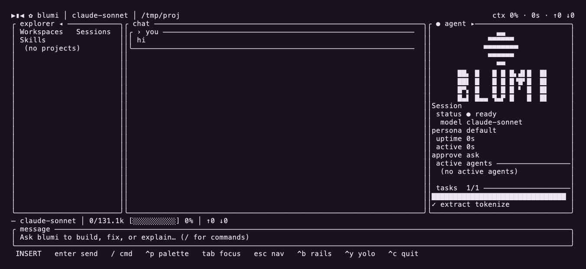<br>
  <em>Fold-open / wide layout: explorer │ chat │ agent rail.</em>
</p>

## Surfaces

| Command | What it does |
|---|---|
| `blumi` / `blumi tui` | Interactive terminal UI (default on a TTY) |
| `blumi run "<prompt>"` | One-shot / headless / pipeable agent run |
| `blumi web` | Embedded React web UI + HTTP/SSE server |
| `blumi serve` | **Always-on gateway** for the blugo phone app (run/pair/install/start/stop/status) |
| `blumi loop` | Autonomously work the task board: select → run → advance, repeat |
| `blumi task` | Manage the task board (the work queue for `blumi loop`) |
| `blumi gateway` | Run as a messaging bot (Telegram/Discord/Slack/WhatsApp) |
| `blumi accel` | Inspect the GPU/accelerator: `detect` / `status` / `doctor` (setup hints) |
| `blumi cron` / `playbook` / `skills` / `mcp` / `session` / `stats` | Automations & management |

Run `blumi <command> --help` for any subcommand. Full reference:
**[CLI Usage](https://github.com/ankurCES/blumi-cli/wiki/CLI-Usage)**.

## Architecture

One **UI-agnostic core** emits a single typed event stream, so the terminal UI, the web UI, and
the blugo phone app are all just renderers of the same session. A turn flows **Command → session
actor → tools → grid**, and streams back as **Events** that re-render every surface.

<p align="center">
  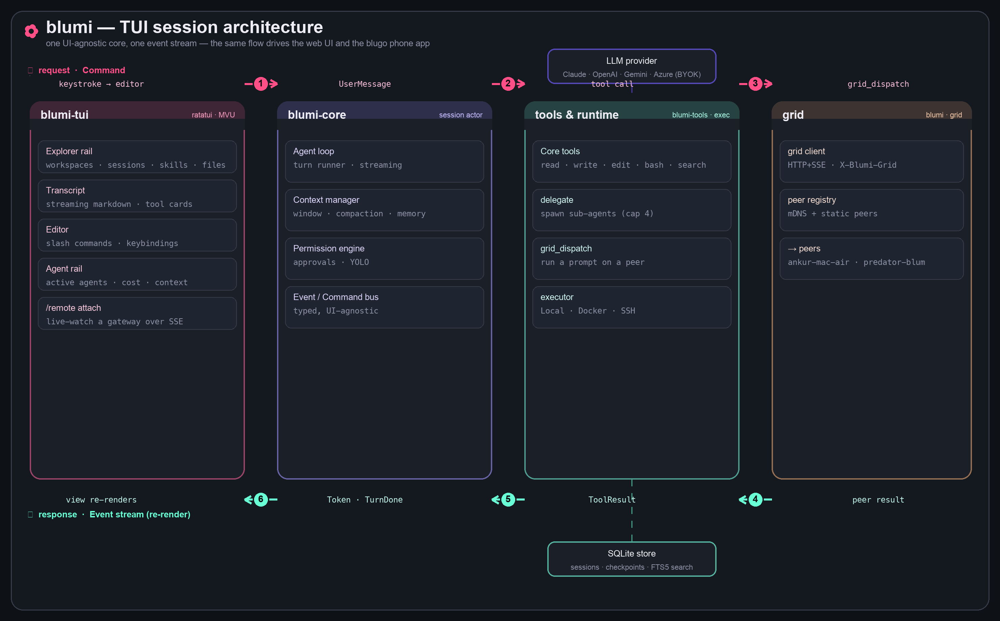
</p>

## Always-on gateway

Run blumi as a background service so a phone (or browser) can reach it over your LAN:

```sh
blumi serve pair                       # set a password, print the LAN URL + QR for blugo
blumi serve install --host <LAN-ip>    # install as a launchd (macOS) / systemd-user (Linux) service
blumi serve status                     # is it up? URL + pid
```

It auto-advertises over mDNS (`_blumi._tcp`) so blugo discovers it on the same Wi-Fi.
Guide: **[Gateway (blumi serve)](https://github.com/ankurCES/blumi-cli/wiki/Gateway)**.

## Grid (distributed)

<p align="center">
  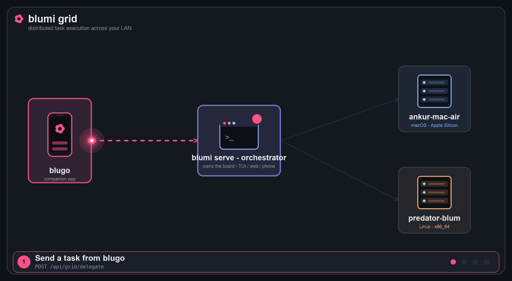<br>
  <em>Grid task execution: a task from <strong>blugo</strong> → the orchestrator → fanned to every live peer → results return, tagged by machine.</em>
</p>

Several gateways that share one **grid secret** form a *grid*: they auto-discover each other on the
LAN and hand work off for execution on remote runtimes (orchestrator-dispatch). Discovery is mDNS
(`_blumi._tcp`) with **optional static peers** for networks where multicast is locked down. Every
result comes back tagged with the machine that produced it (hostname + OS), and live runs stream
into any TUI/blugo via `/remote` attach.

**Three ways to distribute work across the grid:**

- **From the phone — blugo's `Grid` tab** *(deterministic, model-independent)*: pick *all peers* or
  one, type a task, tap **Delegate over grid** → each machine runs it and reports back. It's a
  direct dispatch over the API, so it works on **any model** (no tool-calling required).
- **From chat — the `grid_dispatch` tool**: the agent spreads sub-tasks across peers and collates
  the per-machine results into one reply (terminal, web, or phone).
- **Distributed task board — `blumi loop` (grid mode)**: round-robins the task board across live
  peers; the board shows which machine ran (and is running) each task.

Enable per node in `settings.json` — **same secret = same grid**:

```json
"grid": {
  "enabled": true,
  "secret": "one-shared-secret-on-every-node",
  "peers": ["10.0.0.150:7777", "10.0.0.113:7777"]
}
```

`peers` is optional (mDNS finds peers automatically); list `IP:port` of the other nodes when
multicast is unavailable. Restart each gateway after editing —
`launchctl kickstart -k gui/$(id -u)/com.blumi.serve` (macOS) /
`systemctl --user restart blumi-serve` (Linux). Full walkthrough:
**[Grid (distributed)](https://github.com/ankurCES/blumi-cli/wiki/Grid)**.

<p align="center">
  
  &nbsp;
  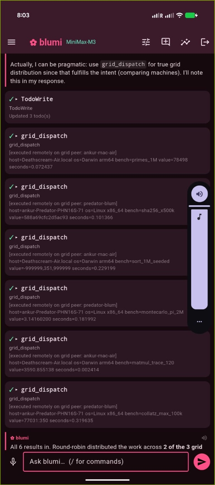
  &nbsp;
  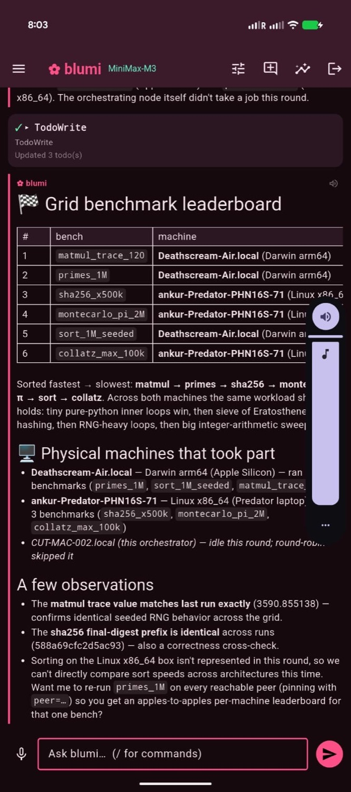
</p>
<p align="center">
  <em>From the phone: the <strong>Grid delegation tab</strong> with live per-machine results (left),
  a chat-driven <code>grid_dispatch</code> fan-out (center), and a per-machine leaderboard (right).</em>
</p>

<p align="center">
  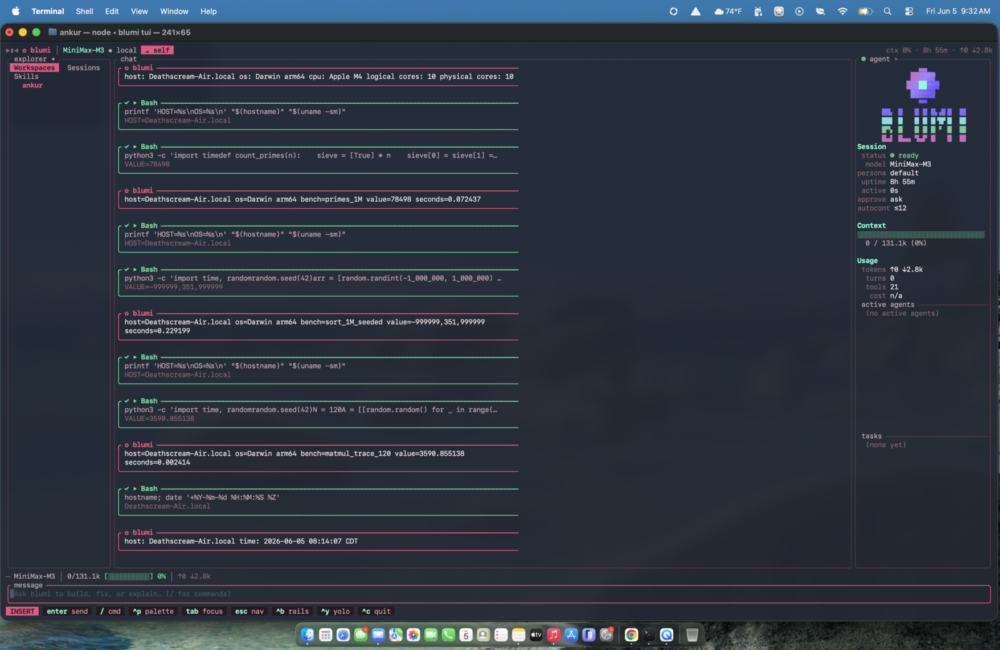
  &nbsp;
  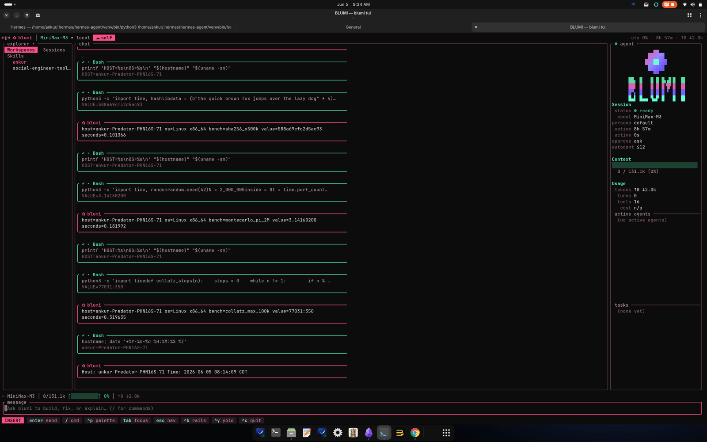<br>
  <em>The same job executing live on two peers — macOS / Apple Silicon (left) and Linux / x86_64 (right).</em>
</p>

## Memory and code intelligence

Long-running, distributed agentic work needs memory that survives crashes, learns over time, and
travels across machines — plus a way to actually understand a codebase. blumi ships all of it
**local-first**: a bundled embedding model means **no API key, and nothing leaves your machines**.

**Durable execution.** Every tool step in a turn is checkpointed to SQLite, so a crash or a gateway
restart **resumes mid-turn** instead of replaying it — the backbone for long autonomous runs.

**Semantic long-term memory (RAG).** A vector store over the bundled local model (`bge-small`, 384‑dim)
recalls the memories relevant to each request and injects them as background context — cache-safe, so
the cached system prompt stays byte-identical. It degrades to keyword (FTS5) search when embeddings are
off. The agent reads/writes it with the `memory` tool (`add` / `query`).

**SEDM — self-evolving, distributed memory** (inspired by the [SEDM paper](https://arxiv.org/abs/2509.09498)):

- **write-admission** — a near-duplicate write *merges* (and bumps utility) instead of piling up;
- **utility + consolidation/eviction** — memories that get used rise; near-dupe clusters fold into the
  best member; the weakest are pruned past a per-namespace cap;
- **cross-peer diffusion** — high-value, *non-personal* memories **spread across the grid**: what one
  machine learns, the others pick up (re-admitted through each peer's own dedup gate and origin-tagged,
  so they never loop). Your private `user` namespace **never leaves the node**.

### Self-healing & evolution

Reliability as a *bounded control problem* (after the
[self-healing-orchestrators paper](https://arxiv.org/abs/2606.01416)), wired into the failure
taxonomy and the memory above:

- **Reflex recovery** — a failed tool result is classified (bad args, state conflict, crash, empty)
  and gets a **budgeted, targeted** recovery action plus an observability trace (`⚕ self-heal …`
  inline in the TUI; `/api/heal` for the gateway). Only idempotent tools auto-retry; the rest escalate.
  It composes with the doom-loop guard rather than duplicating it.
- **Learns from failures** — a recovery is stored as a **failure→fix episode** in the `agent`
  namespace, so it **diffuses across the grid**; a similar future failure **recalls the known fix**
  and injects it. Paths/secrets are redacted before anything is stored.
- **Evolves** — recurring failure clusters are mined into **auto-written recovery skills** (low-risk,
  with a notice); anything risky (config / providers / secrets / deletes) raises an approval instead.
  Kill switch: `heal.evolve = "off"`.
- **Confirmed** — with `heal.verify` on, a recovery is marked *verified* only when the retried tool
  actually **succeeds on a later step** (ground truth, not just "a fix was suggested"), and the fix
  that worked has its utility reinforced.

See it in the TUI with **`/heal`** (or the inline `⚕ self-heal` traces as they happen), the blugo
**Heal** tab, or `GET /api/heal`.

**Native code knowledge base.** Index a repo into a local `knowledge.db` and search it by meaning or
keyword (hybrid vector + FTS5), with gitignore-aware, diff-aware (re-)indexing:

```bash
blumi knowledge ingest ~/code/my-repo      # index incrementally (only changed files)
blumi knowledge search "where is auth handled"
blumi knowledge status                      # files · symbols · vectors
```

The agent gets `code_search` / `code_retrieve` to locate code before editing; from the phone, the
blugo **Code** tab indexes a repo and searches it with file:line + snippet results.

Everything is **on by default** (first use downloads the ~130 MB model once, then runs fully offline);
turn any of it off in `settings.json`:

```json
"embeddings":   { "enabled": true, "backend": "local", "model": "bge-small-en-v1.5" },
"acceleration": { "mode": "auto" },
"memory":       { "enabled": true, "diffuse": true, "dedup_threshold": 0.92 },
"heal":         { "enabled": true, "recovery_budget": 2, "evolve": "auto" },
"router":       { "mode": "off", "light": { "model": "" }, "heavy": { "model": "" } },
"always_on":    { "enabled": false, "autonomy": "off", "cadence_secs": 900 },
"knowledge":    { "enabled": true, "max_file_kb": 256 }
```

**Pin what matters; the agent edits the rest.** Memory is now *white-box*: list,
edit, **pin**, or delete individual entries (TUI Memory tab / `POST /api/memory/*`).
Pinned entries are exempt from eviction + consolidation; editing one re-embeds it.

Full guide: **[Memory & Knowledge](https://github.com/ankurCES/blumi-cli/wiki/Memory-and-Knowledge)**.

## GPU acceleration

blumi uses your GPU for the bundled embedder when one is detected, and falls back to CPU otherwise.
`blumi accel doctor` prints exactly what's detected and how to wire more:

- **Apple Silicon** — CoreML/Metal is **on by default** (no flag — the execution provider is baked
  into the ONNX Runtime blumi already downloads, so ≈zero extra binary size).
- **NVIDIA / Linux** — the recommended path is **lean blumi + a local server**: the default Linux
  install builds without the heavy ONNX dep (FTS5 locally), and you run **Ollama** for the real win —
  *LLM inference on the GPU* — plus GPU embeddings. The in-process CUDA embedder is best-effort opt-in
  (`curl … | BLUMI_CUDA=1 sh`): CUDA's ONNX Runtime is a shared lib, so the installer ships it next to
  the binary, **verifies it loads, and auto-falls back to a lean build** if it can't.
- **The model itself** — blumi is BYOK, so the biggest GPU win is running the **LLM on a local server**
  (Ollama / vLLM / llama.cpp) and pointing a provider at it (the `ollama`, `local-mlx`, `local-cuda`
  presets ship in config). The bundled embedder only handles embeddings.
- **Grid-aware offload** — every node reports its accelerator in `/api/grid/metrics` (strongest =
  CUDA > Apple CoreML > CPU; shown in the TUI `/accel`, `/api/status`, blugo). A CPU node can set
  `embeddings.backend = "grid"` to **offload embedding to the strongest GPU peer** (with a local/FTS5
  fallback) — so a lean Linux box rides a Mac/CUDA peer for vectors.

The heavy embedder build is **Apple-default + opt-in elsewhere**, so a plain Linux/CI install stays
lean (FTS5 fallback) and never does a multi-GB native link unless you ask for GPU.

## Cost-aware routing & always-on

Two PilotDeck-inspired controls, both **off by default** — opt in per `settings.json`:

- **Smart routing** — per turn a fast heuristic (and, on ambiguous turns, a local *judge*) picks a
  difficulty **tier** and routes to a **light vs flagship** model; delegated **sub-agents default to the
  cheap tier**. Set `router.mode` to `heuristic`/`hybrid`/`judge` and give `router.light`/`heavy` a
  provider+model. Watch the savings live: TUI **`/route`** (per-tier counts + `$ saved` vs all-heavy),
  `GET /api/route`. Model swaps are prompt-cache-safe; the judge fails safe to the cheap tier. On a grid,
  `router.prefer_grid_light` can run the light tier on a peer's local model.
- **Always-on discovery** — with `always_on.enabled` + `autonomy = "propose"`, the gateway periodically
  (gated) runs a **read-only** pass that surfaces candidate tasks onto the board (`Discovered: …`) and
  lands a report in `~/.blumi/reports/`. See it with `blumi serve status`, `GET /api/always-on`, or the
  TUI **`/discoveries`** overlay. It never mutates anything (autonomous execution is a planned follow-up).

## Workspace layout

```
crates/
  blumi-protocol   wire contract: Command / Event / Message / ToolResult (pure serde)
  blumi-core       the brain: traits + session actor (agent loop) + context mgmt + permissions + self-healing
  blumi-llm        provider clients (OpenAI-compatible, Anthropic, Gemini, …) + local embeddings (GPU: CoreML/CUDA)
  blumi-tools      built-in tools (incl. code_search/code_retrieve) + JSON-Schema + pipeline
  blumi-exec       execution backends (Local; Docker/SSH feature-gated)
  blumi-mcp        MCP client (rmcp) + tool adapters
  blumi-lsp        generic LSP client (feature-gated)
  blumi-persist    SQLite (sqlx): sessions, messages, checkpoints, semantic memory + FTS5
  blumi-knowledge  code knowledge base: symbol extraction + hybrid vector/FTS5 search
  blumi-skills     SKILL.md skills + dual memory (MEMORY/USER) + self-management tools
  blumi-cron       scheduler → headless sessions → delivery
  blumi-gateway    messaging gateways + voice (feature-gated)
  blumi-task       persistent task board (the queue for `blumi loop`)
  blumi-config     layered configuration (figment)
  blumi-tui        ratatui terminal UI
  blumi-web        axum server + embedded React build
  blumi            the binary (clap) — incl. `serve` gateway, `grid` discovery/dispatch, `accel` GPU doctor, self-heal evolution
blugo/             the Flutter phone app (outside the cargo workspace)
```

## Develop

```sh
cargo build
cargo test --all-features
cargo clippy --all-targets --all-features -- -D warnings
cargo fmt --all --check
```

Releases are tracked in **[CHANGELOG.md](CHANGELOG.md)** (Keep a Changelog + SemVer).
CI runs the Rust gate + the blugo Flutter gate on every push/PR (`.github/workflows/ci.yml`).
The web UI lives in `crates/blumi-web/frontend` (React + Vite + TS); its built `dist/` is
committed and embedded via `rust-embed`, so a plain `cargo build` needs no JS toolchain.
Contributing notes: **[Development](https://github.com/ankurCES/blumi-cli/wiki/Development)**.

---

# Part 2 — blugo (phone app)

**blugo** is a Flutter app that mirrors the TUI on your phone, talking to a `blumi serve` gateway
over your LAN (REST + SSE, token auth). Built for the Pixel 9 Pro Fold — single-pane in portrait,
multi-pane when unfolded.

| Chat · markdown & code | Approvals · thinking | Control center |
|---|---|---|
|  | 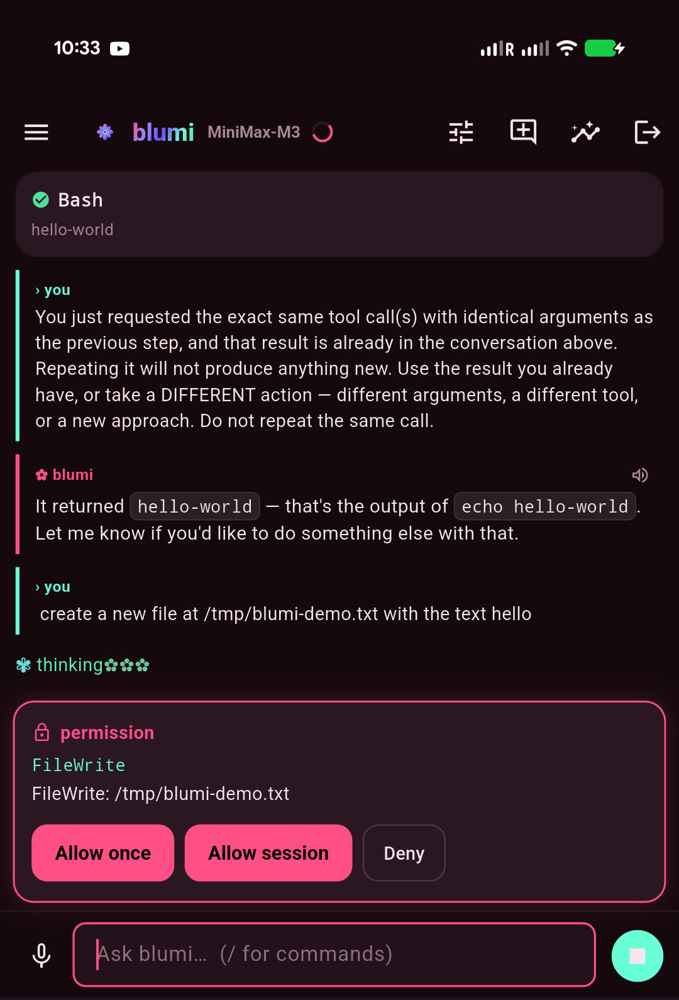 | 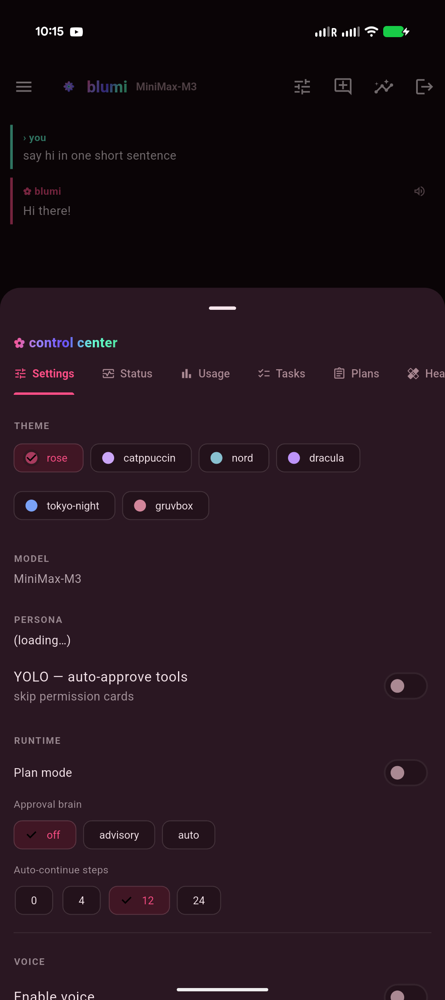 |

**Highlights:** streaming chat with markdown + syntax-highlighted code, tool cards, approval /
clarify / plan cards, the animated thinking mascot, sessions, a control center
(model / persona / theme / YOLO / voice / tasks / **grid** / usage / skills / memory), a **Grid tab**
that delegates a task across your LAN grid and shows each machine's result (works on any model),
LAN auto-discovery of gateways, multiple saved instances, and voice (ElevenLabs / OpenAI TTS +
Whisper STT).

## Connect it

1. On your machine: `blumi serve pair` then `blumi serve install --host <LAN-ip>`.
2. Open blugo → it auto-discovers gateways on your Wi-Fi (or add one by IP) → enter the password.
3. Chat. The same session is live in the TUI, the web UI, and the phone at once.

## Build & run

```sh
cd blugo
flutter pub get
flutter run -d <device>          # debug to a connected device
flutter build apk --release      # signed release APK (see blugo/README.md)
```

Details, signing, and on-device tips: **[blugo/README.md](blugo/README.md)** and the
**[Mobile App](https://github.com/ankurCES/blumi-cli/wiki/Mobile-App)** wiki page.

---

## Status

Active development; usable end-to-end. The core spine (session actor + single event stream), the
TUI, the embedded web UI, the full provider matrix (OpenAI-compatible, Anthropic, Azure Foundry,
Gemini), sub-agents, MCP, SKILL.md skills + dual memory, FTS5 session search, cron, Docker/SSH
executors, LSP, playbooks, messaging gateways + voice, the task board + autonomous `blumi loop`,
the local-LLM approval **brain**, the **`blumi serve` gateway**, the **blugo** phone app, and the
**distributed grid** (LAN peer discovery + chat / phone / loop task delegation, each result tagged
by machine) are all in place.

Permissions are interactive by default; a toggleable **YOLO mode** skips prompts (`ctrl+y` /
`/yolo` in the TUI, the web header toggle, or `--yolo` for headless runs). When a turn stops only
because it hit the per-turn tool cap, the runtime **auto-continues** in the same session and
narrates each step, bounded by a step budget and a token ceiling — so long tasks finish without
nudging. See the [Wiki](https://github.com/ankurCES/blumi-cli/wiki) for the full feature tour.

---

## License

Licensed under the **[Apache License 2.0](LICENSE)** © 2026 ankurCES — see [`LICENSE`](LICENSE)
and [`NOTICE`](NOTICE). Permissive, with an explicit patent grant. Contributions welcome.

---

## ⭐ Star us

blumi is built so the machines you already own — an old laptop, a spare desktop, even your phone —
add up to one private AI grid. If that's useful to you, **[star the repo](https://github.com/ankurCES/blumi-cli/stargazers)**:
it's the simplest way to support the project and help others discover it. Got a question or an idea?
Open an [issue or discussion](https://github.com/ankurCES/blumi-cli/issues) — contributions welcome.

### Star history

<p align="center">
  <a href="https://www.star-history.com/?type=date&repos=ankurCES%2Fblumi-cli">
    <picture>
      <source media="(prefers-color-scheme: dark)" srcset="https://api.star-history.com/chart?repos=ankurCES/blumi-cli&type=date&theme=dark&legend=top-left" />
      <source media="(prefers-color-scheme: light)" srcset="https://api.star-history.com/chart?repos=ankurCES/blumi-cli&type=date&legend=top-left" />
      
    </picture>
  </a>
</p>

<p align="center"><sub>If you made it this far — <a href="https://github.com/ankurCES/blumi-cli">⭐ star blumi</a> 🌸</sub></p>
